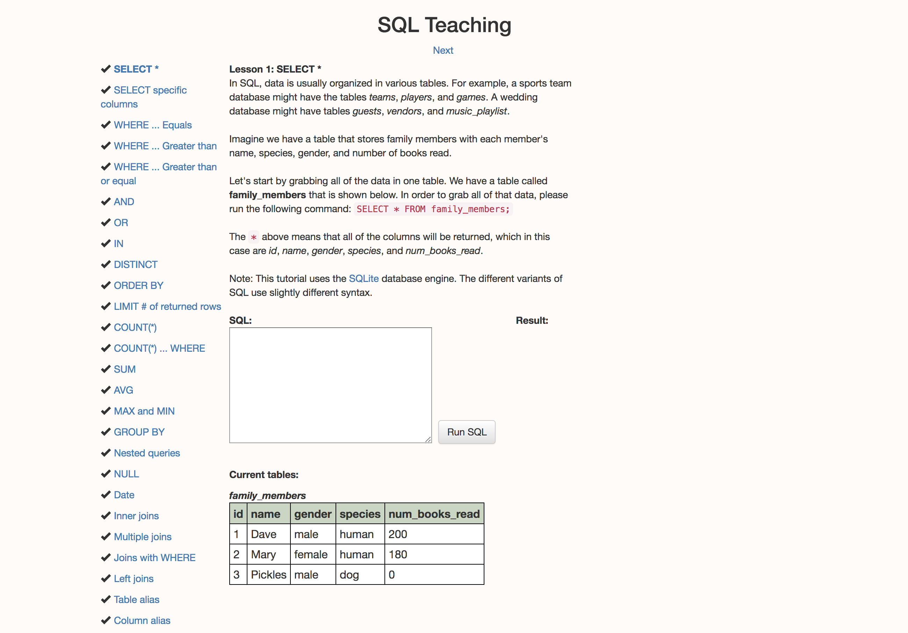
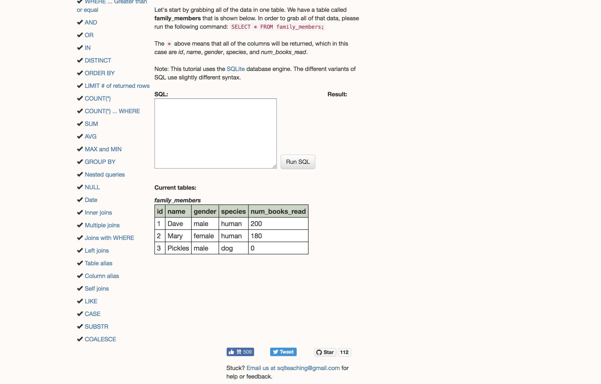

##  proof
1. Lynda Course completion proof.


2. SQL Teaching completion screen shots.





##  Setup
1. Connect to the database
```{r}
library(RMySQL)
library(dplyr)

con2 <- dbConnect(MySQL(),
                 user = 'trial',
                 password = 'password',
                 host = '127.0.0.1',
                 dbname='titanic')

```
2. What tables are in this database? Load the titanic data:
```{r}
titanic <- read.table("/home/php2560/titanic.csv", header=TRUE, sep=",")
query <- "show tables;"
head(dbGetQuery(con2, query))
```

3. Create a table in MySQL from this data. Name it titanic_Wang:
```{r}
dbWriteTable(con2, "titanic_Wang", titanic, overwrite = TRUE)
```

4. Now what tables are in this database?
```{r}
query <- "show tables;"
head(dbGetQuery(con2, query))
```

## R and MySQL
1. Run the following SQL command. Before doing so describe what this is asking.

```{r}
# Select pclass, survived, average age column from titanic_Wang database and group it by pclass and survived.
dbGetQuery(con2, "select pclass, 
                  survived, 
                  avg(age) as avg_age from titanic_Wang group by pclass, 
                  survived")

```

2. Run the following SQL command. Before doing so describe what this is asking

```{r}
# Select pclass, survived and average age column from titanic_Wang database who has to be survived and group them by pclass and survived.
dbGetQuery(con2, "select pclass, 
                  survived, 
                  avg(age) as avg_age from titanic_Wang where survived=1 group by pclass, 
                  survived;")
```

3. Run the following SQL command. Before doing so describe what this is asking

```{r}
# Select the name, pclass, survived and age column from titanic_Wang whose name consist "sen" in it.
dbGetQuery(con2, "select name, 
                  pclass, survived, 
                  age from titanic_Wang where name regexp '^.sen.+';")
```

4. Run the following SQL command. Before doing so describe what this is asking

```{r}
# Select name, pclass, survived and age column from titanic_Wang whose name should start with Jakob.
dbGetQuery(con2, "select name, 
                  pclass, 
                  survived, 
                  age from titanic_Wang where name regexp 'Jakob.*$';")
```

5. Run the following SQL commands. What is different about them? What do they return?

```{r}
# Select the name, pclass, survived and age column from titanic_Wang database whose name has to have ivar in it.
dbGetQuery(con2, "select name, 
                  pclass, 
                  survived, 
                  age from titanic_Wang where name regexp 'Ivar.*$';")
```


```{r}
# Select the name, pclass, survived and age column from titanic_Wang database whose name has to have ivar as an individual word in it.
dbGetQuery(con2, "select name, 
                  pclass, 
                  survived, 
                  age from titanic_Wang where name regexp ',.*Ivar.*$';")
```

6. We can also plot data from this:
```{r, message=FALSE, warning=FALSE}
myQuery <- "select pclass, 
            avg(fare) as avg_fare from titanic_Wang group by pclass;"
myData <- dbGetQuery(con2, myQuery)
library(ggplot2)
ggplot(myData, aes(pclass, avg_fare)) + geom_bar(stat="identity")
```


## More challenging
1. Create a data frame with:
  "pclass"
  "sex"
  "age"
  "fare"
  "survived"
  "parch"
Only for people who did not survive.

```{r}
head(dbGetQuery(con2, "SELECT pclass, 
                      sex, 
                      age fare, 
                      survived, 
                      parch FROM titanic_Wang WHERE survived = 0"))
```


2. Create a graph of the average survival over the different classes. Make two distinct lines for male and female passengers. Create this plot using ggplot.
```{r}
AVGsurvival <- dbGetQuery(con2,"SELECT AVG(survived) as avg_survival, 
                                sex, 
                                pclass FROM titanic_Wang GROUP BY pclass, 
                                sex")

AVGsurvival <- AVGsurvival %>% filter(!is.na(avg_survival))

ggplot(AVGsurvival, aes(x = pclass, y = avg_survival, color = sex)) + geom_line()
```


